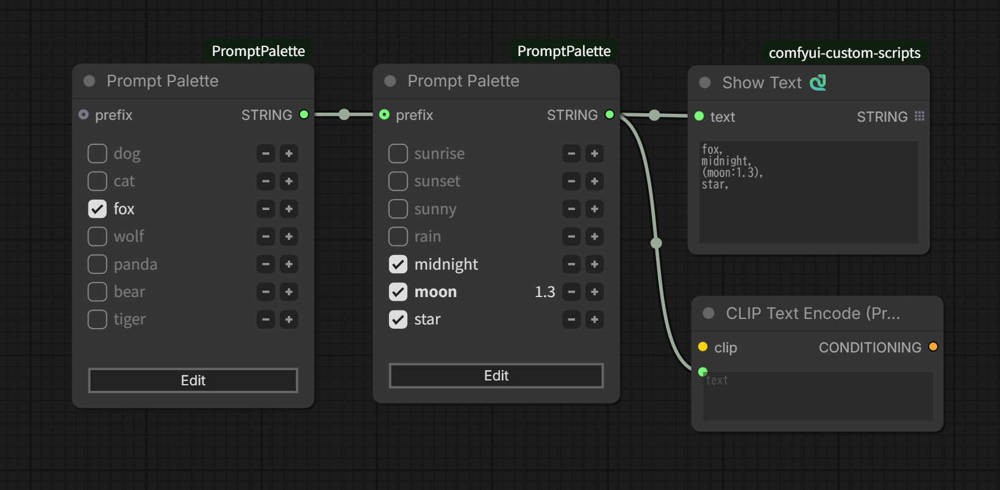
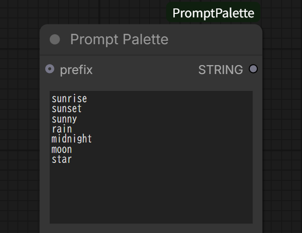
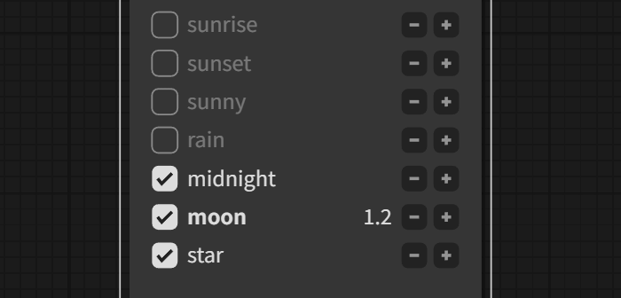
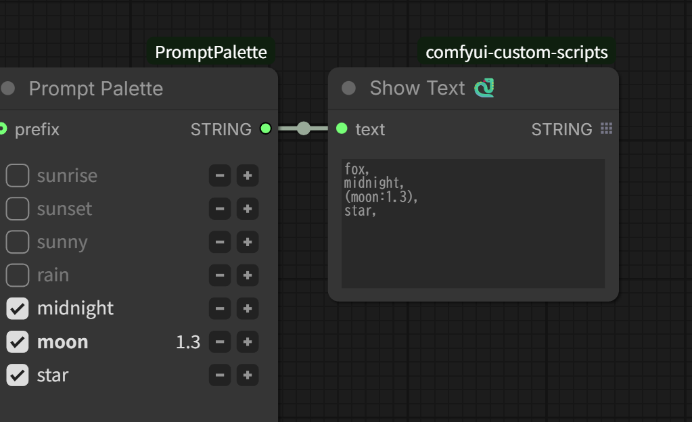
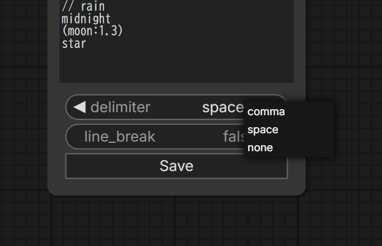

# ComfyUI PromptPalette

## checkbox covert to Radio Button

A custom node for ComfyUI that makes prompt editing easier by allowing phrase switching with just mouse operations

## Features

- **Enable/disable phrases** with checkboxes
- **Adjust prompt weights** using +/- buttons
- **Combine with other prompts** using prefix input
- **Customize output format** with delimiter and line break options

## Installation

1. Clone into the `custom_nodes` directory of ComfyUI
2. Restart ComfyUI

## Usage

1. **Add node**: Find `Prompt Palette` in the node menu
2. **Edit phrases**:
   - Click the **Edit** button to switch to edit mode
   - Enter one phrase per line 
     
   - Click the **Save** button to complete editing
3. **Toggle phrases and adjust weights**:
   - **Toggle checkboxes** to enable/disable phrases
   - **Adjust prompt weights** using +/- buttons 
     
4. **Output**:
   - By default, selected phrases are output as comma-separated prompt text 
     
   - Delimiter and line break settings can be changed in edit mode 
     

## Changelog

### v1.3.0
- Added delimiter widget to separate phrases with comma, space, or nothing
- Added line_break widget to output as single line or multiple lines

### v1.2.0
- Support for ComfyUI Nodes 2.0
- Major code refactoring

### v1.1.0
- Updated UI style
